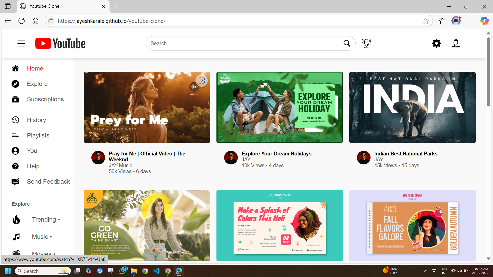

# youtube-clone

A modern, responsive front-end clone of YouTube built using **HTML**, **CSS**, and **JavaScript**. It mimics the layout and basic UI features of the popular video-sharing platform.

---
## 🌐 Live Demo

🔗[Netlify Link](https://jayesh-youtube.netlify.app/)

## 📸 Preview

---

## 🚀 Features

- 🎨 Fully responsive layout
- 🔍 Search bar with microphone icon
- 📂 Sidebar with navigation links
- 🖼️ Thumbnail video previews
- 👤 Profile and settings icons
- 📱 Mobile-friendly design

---

## 🛠️ Tech Stack

- **HTML5** – Semantic structure
- **CSS3** – Flexbox & Grid-based layout
- **JavaScript** – Sidebar toggle functionality
- **Assets** – Custom icons, thumbnails, and banner images

---

## 📁 Folder Structure

youtube-clone/
├── index.html
├── styles.css
├── side-bar.js
├── assets/
│ ├── logo.png
│ ├── menu.png
│ ├── mic.png
│ ├── search.png
│ ├── settings.png
│ ├── thumbnails/
│ │ ├── thumbnail1.png
│ │ ├── thumbnail2.jpg
│ │ └── ...
│ └── profilephoto.jpg
└── README.md
